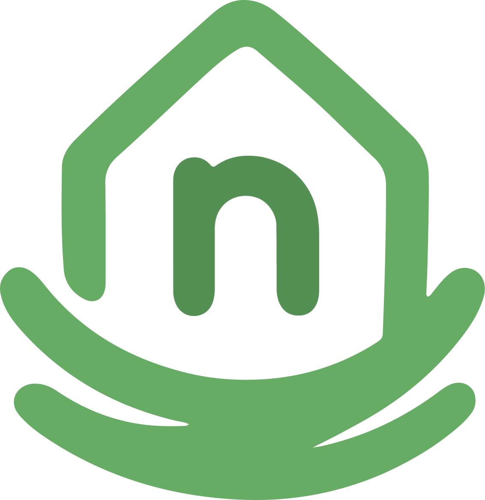

<p align="center">
  
</p>

# Nidush

> **University Project - MVP | Master's in Communication and Web Technologies (MCTW)**

**Nidush** is a smart home and wellbeing application created for the **Altice Labs** challenge. The project explores how a home can become a calmer, more adaptive space by combining guided activities, ambient scenarios, digital content and smart device interactions.

The app is focused on people dealing with stress or anxiety in urban contexts. Instead of treating smart home devices as isolated controls, Nidush groups them into emotional routines: cooking, meditation, workouts, audiobooks, focus mode and room atmospheres.

[](https://drive.google.com/drive/folders/1574BepiHOLFtc2zvkSyJQmq_g9qTiNVV)
[](https://reactnative.dev/)
[](https://www.typescriptlang.org/)
[](https://www.nativewind.dev/)
[](https://supabase.com/)
[](https://github.com/Nidush/Nidush/actions/workflows/cicd-nidush.yml)

---

## Features

- **Guided Activities:** Meditation, cooking, workout and audiobook experiences connected to content, room ambience and optional focus mode.
- **Recommended Activities:** Dynamic recommendations based on app catalog templates, user preferences and biometric state.
- **AI Activity Ideas:** Gemini-powered activity suggestions adapt to the user's current emotional/biometric state, available rooms, connected devices and hobbies.
- **Activity Creator:** Step-by-step flow to create personal activities with type, content, room, environment, image and review.
- **Atmospheric Scenarios:** Room presets that combine devices, playlists and ambience.
- **Smart Home Device Layer:** Device cards and room views for connected or simulated devices.
- **Focus Mode:** Activity sessions can reduce distractions while the user is doing an activity.
- **Multi-user Homes:** Users can create or join a home with resident/admin roles.
- **Profile & Onboarding:** User setup, hobbies/preferences, home selection and resident profile flow.
- **Spotify Integration:** Spotify authentication and playlist support for immersive sessions.
- **Biometric State Engine:** Personalized `RELAXED` / `FOCUSED` / `STRESSED` / `ANXIOUS` detection based on heart rate, HRV and EDA deviations from the user's own baseline.
- **Weekly API Sync:** A Supabase cron job refreshes external API content every week without creating duplicates.
- **Policies & Legal Pages:** Privacy Policy and Terms of Service documents are included.

---

## Development Highlights

Recent development work includes:

- **Supabase integration:** Auth, database migrations, RLS policies, Storage support, Edge Functions and production-ready data flows.
- **Weekly API automation:** A scheduled Supabase cron job refreshes external content from TheMealDB and WorkoutX, caching workout GIFs in Supabase Storage to avoid repeated client/API requests.
- **Activities catalog split:** App-provided activities now live in `activity_templates`, while user-created activities remain in `activities`.
- **Recommendations fixes:** Recommended activities now correctly include app-provided catalog items in **Activities** and **Activities for you**.
- **Profile and avatars:** Profile data, account summary, avatar storage and resident/home associations were improved.
- **Home management:** Create/join home flows, join codes, resident roles and related Supabase functions were added or refined.
- **Shortcuts and notifications:** Shortcut persistence, ordering, notification access and activity entry points were improved.
- **Spotify and media sessions:** Spotify flows, playlist support, background playback behavior and media session handling were integrated.
- **TV/casting support:** TV video activity support and Google Cast-related session behavior were added.
- **Biometrics and recommendations:** Biometric testing, state-based recommendations and home activity suggestions were improved.
- **Personalized state classification:** Biometrics now use a baseline-driven scoring model with local persistence, instead of only fixed thresholds.
- **AI home suggestions:** `generate-activity-ideas` now adapts generated ideas to the user's detected state and falls back to mood-aware local suggestions if Gemini is unavailable.
- **Security updates:** Password validation, signup security and auth-related flows were strengthened.
- **CI/CD:** Supabase and app workflow checks were added/refined to run across branches.
- **Documentation:** Privacy Policy, Terms of Service, Spotify submission notes and Supabase setup documentation were added.

The weekly API sync was deployed and manually tested successfully:

```json
{
  "status": "success",
  "insertedCount": 8,
  "updatedCount": 2,
  "skippedCount": 0
}
```

---

## Tech Stack

### App

- **React Native 0.81**
- **Expo SDK 54**
- **Expo Router 6** for file-based navigation
- **TypeScript 5**
- **React 19**
- **NativeWind + Tailwind CSS** for styling
- **React Context API** for app contexts
- **Redux Toolkit** available for state management
- **Expo Google Fonts** with Nunito
- **Expo Notifications, Audio, Video, Image Picker, Auth Session and Web Browser**
- **React Native Google Cast** for cast/media features
- **React Native Health Connect** for wearable/health integration support

### Backend & Database

- **Supabase Auth**
- **Supabase Postgres**
- **Supabase Row Level Security policies**
- **Supabase Storage** for uploaded images/assets
- **Supabase Edge Functions**
- **Supabase Cron / `pg_cron`**
- **`pg_net`** for scheduled HTTP calls from Postgres to Edge Functions

### APIs & Integrations

- **TheMealDB API:** Imports recipe content.
- **WorkoutX API:** Imports workout/exercise content and weekly cached GIFs.
- **Spotify API:** Authentication, playlists and music-related session support.
- **Resend API:** Welcome email Edge Function.
- **Google Gemini API:** Personalized activity idea generation in the `generate-activity-ideas` Edge Function.

### Testing & Tooling

- **Jest**
- **React Testing Library**
- **Selenium WebDriver** for onboarding E2E flow
- **ESLint**
- **Prettier**
- **Supabase CLI**

---

## Project Structure

```text
app/                         Expo Router screens and tabs
components/                  Reusable UI and feature components
constants/                   Static data, theme values and device config
context/                     React Context providers
utils/                       Supabase client, recommendation logic, helpers
supabase/functions/          Supabase Edge Functions
supabase/migrations/         Database schema, policies, seeds and cron jobs
scripts/                     Utility scripts
assets/                      Images, videos, audio and app assets
__tests__/                   Jest tests
selenium/                    E2E test specs
```

---

## Getting Started

### Prerequisites

- **Node.js LTS**
- **npm**
- **Git**
- **Expo Go** for mobile testing, or Android Studio/iOS Simulator
- **Supabase CLI** for database/functions work

Install Supabase CLI if needed:

```bash
npm install -g supabase
```

### 1. Clone The Repository

```bash
git clone https://github.com/Nidush/Nidush.git
cd Nidush
```

### 2. Install Dependencies

```bash
npm install
```

### 3. Configure Environment Variables

Create a local `.env` file from the example:

```bash
cp .env.example .env
```

Fill in:

```env
EXPO_PUBLIC_SUPABASE_URL=
EXPO_PUBLIC_SUPABASE_ANON_KEY=
EXPO_PUBLIC_SPOTIFY_CLIENT_ID=
EXPO_PUBLIC_SPOTIFY_SCHEME=
EXPO_PUBLIC_ENABLE_AI_AUTO_CALLS=true
WORKOUTX_API_KEY=
PORT=3000
```

Important:

- Do not commit `.env`.
- Public Expo variables must start with `EXPO_PUBLIC_`.
- Secret API keys used by Edge Functions must also be stored in Supabase secrets.
- `EXPO_PUBLIC_ENABLE_AI_AUTO_CALLS=false` disables the automatic AI recommendation calls on screen load/focus. In development it defaults to `true`; in production builds it now defaults to `false` unless you explicitly enable it.

### 4. Start The App

```bash
npm start
```

Then:

- Scan the QR code with **Expo Go**.
- Press `a` for Android emulator.
- Press `i` for iOS simulator.
- Press `w` for web.

If cache causes strange behavior:

```bash
npx expo start -c
```

If you are using a development build (`expo-dev-client`), these startup modes are useful:

```bash
npx expo start --dev-client --localhost -c
```

- `--localhost`: best for local-only development on your own machine; it is not suitable for sharing across the network.

```bash
npx expo start --dev-client --lan -c
```

- `--lan`: use this when your phone/emulator is on the same Wi-Fi network as your computer.

```bash
npx expo start --dev-client --tunnel -c
```

- `--tunnel`: best fallback when local network restrictions break device access or when you need a more reliable remote connection path.

---

## Useful Commands

```bash
npm start              # Start Expo
npm run android        # Run native Android build
npm run ios            # Run native iOS build
npm run web            # Start web version
npm test               # Run Jest tests
npm run test:e2e       # Run Selenium onboarding test
npm run lint           # Run Expo lint
npm run format         # Format code
npm run build          # Export web build
```

TypeScript check:

```bash
npx tsc --noEmit
```

Biometric state behavior:

- The app builds a personal local baseline from recent readings (`heartRate`, `hrv`, `eda`).
- State inference compares the latest reading to that baseline instead of relying only on fixed universal thresholds.
- The baseline is persisted locally with `AsyncStorage`, so classification remains personalized across app restarts.

---

## Supabase Setup

Login and link the project:

```bash
supabase login
supabase link --project-ref <project-ref>
```

Apply migrations:

```bash
supabase db push
```

Deploy Edge Functions:

```bash
supabase functions deploy manage-home
supabase functions deploy welcome-user
supabase functions deploy generate-activity-ideas
supabase functions deploy weekly-api-content-sync
```

Set required secrets:

```bash
supabase secrets set WORKOUTX_API_KEY="your-workoutx-api-key"
supabase secrets set GEMINI_API_KEY="your-gemini-api-key"
supabase secrets set ENABLE_GEMINI_API="true"
supabase secrets set ENABLE_AI_RATE_LIMIT="true"
supabase secrets set AI_IDEAS_MAX_REQUESTS_PER_HOUR="10"
supabase secrets set AI_IDEAS_MIN_SECONDS_BETWEEN_REQUESTS="30"
supabase secrets set RESEND_API_KEY="your-resend-key"
```

If you want production to avoid calling Gemini altogether while keeping the local fallback ideas, set:

```bash
supabase secrets set ENABLE_GEMINI_API="false"
```

The AI idea generator now also supports server-side rate limiting:

- `ENABLE_AI_RATE_LIMIT=true`: turns the limiter on.
- `AI_IDEAS_MAX_REQUESTS_PER_HOUR=10`: maximum generations per user in a rolling 1-hour window.
- `AI_IDEAS_MIN_SECONDS_BETWEEN_REQUESTS=30`: cooldown between consecutive generations from the same user.

When the limit is exceeded, the function returns HTTP `429` and tells the app how long to wait.

Optional cron protection:

```bash
supabase secrets set API_CONTENT_SYNC_SECRET="your-random-secret"
```

If `API_CONTENT_SYNC_SECRET` is enabled, set the same value in Postgres so the scheduled cron call can authenticate:

```sql
alter database postgres set app.settings.api_content_sync_secret = 'your-random-secret';
```

---

## Weekly API Content Sync

The project includes a scheduled content refresh:

- **Function:** `supabase/functions/weekly-api-content-sync`
- **Migration:** `supabase/migrations/20260517133000_weekly_api_content_sync.sql`
- **Schedule:** Every Monday at `03:00 UTC`
- **Cron name:** `weekly-api-content-sync`
- **Target table:** `public.contents`
- **Log table:** `public.api_content_sync_runs`

The function fetches:

- Recipes from **TheMealDB**
- 10 exercises from **WorkoutX**
- 10 **English audiobooks** from **LibriVox**
- Workout GIFs are uploaded once per exercise to the public Supabase Storage bucket `api-content-media`

LibriVox notes:

- The API does not support a direct `language` query parameter on the `audiobooks` endpoint, so the function fetches extended audiobook records and filters them locally to `English`
- Audiobooks are stored in `public.contents` with `type = 'audio'` and `category = 'audiobook'`
- The weekly sync prefers audiobooks that are not already in the database, so each week tends to bring different titles until the available pool is exhausted
- Audiobook metadata comes from `https://librivox.org/api/feed/audiobooks`
- Audiotracks are fetched separately from `https://librivox.org/api/feed/audiotracks`
- We store title, cleaned description, year, language, total duration, track list, cover art, and author

It avoids duplicates by:

- Using stable API-based IDs, such as `api_mealdb_<mealId>` and `workoutx_exercise_<id>`
- Checking existing records by `title + author`
- Reusing previously uploaded Supabase Storage GIF URLs when the exercise already exists
- Using Supabase `upsert` on `contents.id`

Optional content-volume overrides:

- `API_CONTENT_SYNC_MEALS`
- `API_CONTENT_SYNC_EXERCISES`
- `API_CONTENT_SYNC_AUDIOBOOKS`

Manual test:

```bash
curl -X POST https://jawmnnwdxfoiirzsyobv.supabase.co/functions/v1/weekly-api-content-sync
```

Check logs:

```sql
select *
from public.api_content_sync_runs
order by started_at desc
limit 10;
```

---

## Mobile Access APK

Since Nidush is mobile-first, testing the Android build gives the best experience:

[**Nidush Android Build - Google Drive**](https://drive.google.com/drive/folders/1574BepiHOLFtc2zvkSyJQmq_g9qTiNVV)

On Android, you may need to allow installation from unknown sources.

---

## Spotify Integration & App Review

Nidush integrates with Spotify to provide immersive music experiences during activities.

### Current Status

- **Spotify mode:** Development Mode
- **Client ID:** configured locally with `EXPO_PUBLIC_SPOTIFY_CLIENT_ID`
- **Scopes:** Playback control, playlist access and current playback information

### Before Spotify App Review

Prepare:

- Hosted Privacy Policy
- Hosted Terms of Service
- App screenshots showing Spotify features
- Description of the Spotify-powered experience

Documentation:

- [Privacy Policy](./PRIVACY_POLICY.md)
- [Terms of Service](./TERMS_OF_SERVICE.md)
- [Spotify Submission Guide](./SPOTIFY_SUBMISSION_GUIDE.md)

Generate HTML policy pages:

```bash
npm run generate:policies
```

---

## Environment Notes

The app expects Supabase and Spotify values in `.env` for local development.

Edge Functions do not read the local `.env` file when deployed. Use:

```bash
supabase secrets set KEY="value"
```

Do not expose service role keys, API secrets or production tokens in the app bundle.

---

## Contributors

Developed as part of the **TDW/MCTW Master's program** for the Altice Labs challenge, by **Group 4**:

- [Eduarda Carvalho](https://github.com/eduardahfc) - 113578
- [Gabriel Teixeira](https://github.com/GabrielTeixei) - 107876
- [Mariana Peixe](https://github.com/MarianaPeixe7) - 113262
- [Pedro Teixeira](https://github.com/pedroteixeira04) - 114323

---

*Nidush: Your home, your safe space.*
